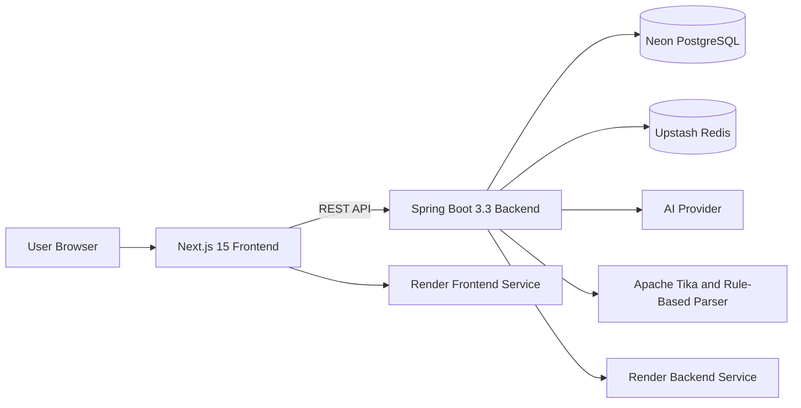
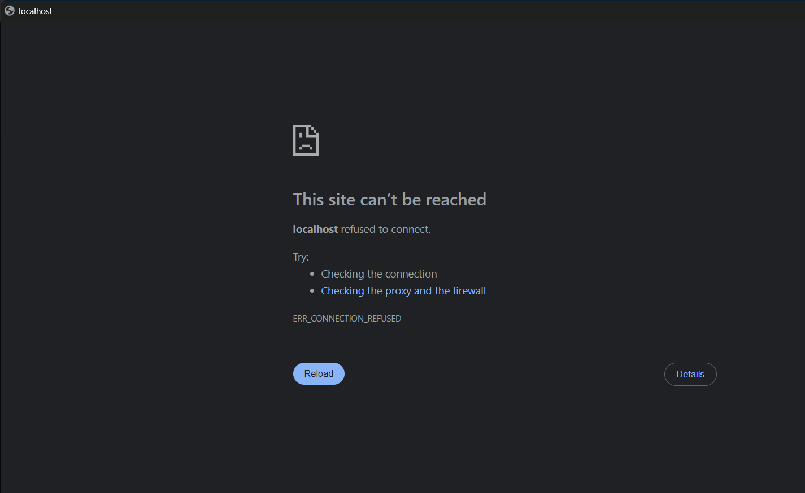

<div align="center">

# 🤖 AI Job Copilot

### Apply smarter. Improve your resume. Track every opportunity.

An AI-powered full-stack SaaS platform that helps job seekers analyse resumes, improve ATS compatibility, generate tailored application content, practise interviews, and manage their complete job-search pipeline.

<br />

[](https://ai-job-copilot-frontend.onrender.com)
[](https://github.com/shivrajks/ai-job-copilot)

<br />


<br />

> The application is deployed on Render’s free tier.  
> The first request may take up to a minute after a period of inactivity.

</div>

---

## 🌐 Live Application

### Frontend

[https://ai-job-copilot-frontend.onrender.com](https://ai-job-copilot-frontend.onrender.com)

### Backend Health

[https://ai-job-copilot-royq.onrender.com/api/actuator/health](https://ai-job-copilot-royq.onrender.com/api/actuator/health)

---

## 📌 Overview

AI Job Copilot brings the major parts of a job search into one connected platform.

Instead of using separate tools for resume analysis, ATS checking, cover letters, interview preparation, and application tracking, users can manage the complete workflow from one dashboard.

The platform supports:

- Resume upload and structured parsing
- Job-description analysis
- ATS resume-to-job matching
- Resume tailoring
- Cover-letter generation
- Interview-question preparation
- Application pipeline tracking
- Dashboard analytics
- Secure account and session management

---

## ✨ Core Features

### 📄 Resume Intelligence

- Upload PDF and DOCX resumes
- Validate uploaded file type and content
- Extract resume text using Apache Tika
- Parse contact details, skills, education, experience, and projects
- Use AI parsing with a rule-based fallback
- Prevent fabricated resume information
- Maintain multiple resume versions
- Rename, delete, re-parse, and activate resumes
- Display structured resume information

### 🎯 ATS Score and Job Matching

- Compare a selected resume with a job description
- Generate an overall ATS compatibility score
- Review category-level scoring
- Identify matched and missing keywords
- Detect skill and experience gaps
- Receive actionable improvement recommendations
- Generate detailed ATS reports
- Recalculate results when the resume or job changes

### 💼 Job Description Management

- Create, edit, view, and delete job descriptions
- Extract job title, company, skills, and experience requirements
- Analyse job-description content
- Connect jobs with resumes, ATS reports, applications, and interviews
- Prevent duplicate requests during analysis

### 📝 AI Resume Tailoring

- Tailor resume sections for a selected job
- Improve professional summaries
- Align skills with role requirements
- Rewrite experience points while preserving factual information
- Review education, skills, experience, and summary suggestions
- Validate tailored content before saving
- Save tailored results as a new resume version

### ✉️ Cover-Letter Generation

- Generate role-specific cover letters
- Use resume and job-description context
- Review and edit generated content
- Save generated cover letters
- Manage multiple cover letters
- Handle AI-provider failures with safe fallbacks

### 🎤 Interview Practice

- Generate job-specific interview questions
- Practise technical, behavioural, and role-related answers
- Submit answers for evaluation
- Receive structured feedback
- Review interview history
- Handle malformed AI responses safely

### 📊 Application Tracker

- Add and manage job applications
- Track company, role, salary, location, notes, and follow-up dates
- Move applications through hiring stages
- Use Kanban and list-based views
- Filter, search, and sort applications
- View detailed application information
- Protect every record with user-ownership validation

### 📈 Dashboard and Analytics

- Review application totals
- Monitor hiring-pipeline stages
- View recent resumes, jobs, interviews, and applications
- Track application activity
- Display populated and empty states
- Prevent stale data after account changes
- Reduce duplicate data fetching during navigation

### 🔐 Authentication and Account Security

- User registration and login
- JWT access and refresh tokens
- Refresh-token rotation
- Unique refresh-token identifiers
- Secure logout and logout-all
- Password change
- Forgot-password and reset-password flows
- BCrypt password hashing
- Account lockout protection
- Authentication rate limiting
- User-session cleanup
- Cross-user data isolation
- Protected frontend routes

### ⚙️ Settings and Profile

- Update account profile
- Change password
- Select default resume
- Manage notification preferences
- Configure dashboard and appearance settings
- Review account-session information

---

## 🧭 Main Application Workflow

```text
Create Account
      ↓
Upload Resume
      ↓
Add Job Description
      ↓
Analyse Job Requirements
      ↓
Generate ATS Match
      ↓
Review ATS Report
      ↓
Tailor Resume
      ↓
Generate Cover Letter
      ↓
Practise Interview Questions
      ↓
Track Application Progress
```

---

## 🏗️ Architecture



---

## 🧱 Technology Stack

### Frontend

| Technology | Purpose |
|---|---|
| Next.js 15 | Application framework and routing |
| React 19 | Component-based user interface |
| TypeScript | Type-safe frontend development |
| Zustand | Global client-state management |
| Tailwind CSS | Responsive styling |
| shadcn/ui | Reusable UI components |
| Framer Motion | Animations and transitions |
| React Three Fiber | Interactive landing-page visuals |

### Backend

| Technology | Purpose |
|---|---|
| Java 21 | Core backend language |
| Spring Boot 3.3 | REST API and application framework |
| Spring Security | Authentication and authorization |
| JWT | Access and refresh-token authentication |
| Maven | Dependency management and builds |
| Flyway | Database schema migrations |
| Apache Tika | PDF and DOCX content extraction |
| Bean Validation | Request and model validation |

### Data and Infrastructure

| Technology | Purpose |
|---|---|
| PostgreSQL 16 | Primary relational database |
| Redis 7 | Caching and supporting runtime features |
| Neon | Managed production PostgreSQL |
| Upstash | Managed production Redis |
| Docker | Local infrastructure and backend deployment |
| Render | Frontend and backend hosting |
| GitHub | Source control and collaboration |

---

## 🔐 Security Highlights

The application includes:

- Stateless JWT authentication
- Rotating refresh tokens
- Random JWT identifiers for refresh-token uniqueness
- BCrypt password hashing
- Account lockout after repeated failed logins
- Rate limiting for authentication endpoints
- Resource-level ownership checks
- Secure CORS configuration
- File-upload validation
- MIME and content verification
- Path-traversal protection
- Structured validation errors
- Safe production error responses
- Secret configuration through environment variables
- User-store cleanup during logout
- Cross-account data-isolation testing

---

## 🧪 Quality Assurance

The project completed a full production-hardening and QA cycle.

### Backend Verification

```text
Tests run: 292
Failures: 0
Errors: 0
Skipped: 0
```

Verified commands:

```bash
mvn clean test
mvn verify
```

Additional runtime verification included:

- Spring Boot startup
- Packaged JAR startup
- PostgreSQL connectivity
- Redis connectivity
- Flyway migration validation
- Health endpoint
- Real authentication flows
- Ownership and authorization boundaries
- Resume, ATS, application, interview, and analytics APIs

### Frontend Verification

Verified commands:

```bash
npm ci
npm audit
npm run lint
npm run type-check
npm run build
```

Results:

- Dependency audit: 0 vulnerabilities
- ESLint: passed
- TypeScript type-check: passed
- Production build: passed
- Browser QA: 83 checks
- Unexpected console errors: 0
- Unexpected failed network requests: 0

### Responsive Checks

The application was tested at:

```text
320 × 568
375 × 667
768 × 1024
1024 × 768
1440 × 900
1920 × 1080
```

---

## 📸 Screenshots

Add sanitized product screenshots to `docs/screenshots/` using these filenames:

| Screen | File |
|---|---|
| Landing page | `docs/screenshots/landing-page.png` |
| Dashboard | `docs/screenshots/dashboard.png` |
| Resume intelligence | `docs/screenshots/resume-upload.png` |
| ATS report | `docs/screenshots/ats-score.png` |
| Application tracker | `docs/screenshots/application-tracker.png` |
| Interview practice | `docs/screenshots/interview-practice.png` |
| Analytics | `docs/screenshots/analytics.png` |
| Settings | `docs/screenshots/settings.png` |

Once the screenshots are available, use this layout:

```html
<div align="center">
  
  
</div>
```

> Do not include API keys, tokens, database URLs, passwords, private emails, or real user data in screenshots.

---

## 📁 Project Structure

```text
ai-job-copilot/
├── backend/
│   ├── src/
│   │   ├── main/
│   │   │   ├── java/com/aicopilot/
│   │   │   │   ├── ai/
│   │   │   │   ├── config/
│   │   │   │   ├── controller/
│   │   │   │   ├── dto/
│   │   │   │   ├── entity/
│   │   │   │   ├── exception/
│   │   │   │   ├── repository/
│   │   │   │   ├── security/
│   │   │   │   └── service/
│   │   │   └── resources/
│   │   │       ├── db/migration/
│   │   │       └── application.yml
│   │   └── test/
│   ├── Dockerfile
│   └── pom.xml
│
├── frontend/
│   ├── public/
│   ├── src/
│   │   ├── app/
│   │   ├── components/
│   │   ├── lib/
│   │   ├── providers/
│   │   └── store/
│   ├── package.json
│   └── eslint.config.mjs
│
├── docker/
│   └── docker-compose.yml
│
├── docs/
│   └── screenshots/
│
├── .gitignore
└── README.md
```

---

## 🚀 Run Locally

### Prerequisites

Install:

- Java 21
- Maven 3.9+
- Node.js 20+
- npm
- Docker Desktop
- Git

### 1. Clone the repository

```bash
git clone https://github.com/shivrajks/ai-job-copilot.git
cd ai-job-copilot
```

### 2. Start PostgreSQL and Redis

```bash
docker compose -f docker/docker-compose.yml up -d
```

Check the containers:

```bash
docker ps
```

### 3. Start the backend

```bash
cd backend
mvn spring-boot:run
```

Backend URL:

```text
http://localhost:8080
```

Health endpoint:

```text
http://localhost:8080/api/actuator/health
```

### 4. Start the frontend

Open a second terminal:

```bash
cd frontend
npm install
npm run dev
```

Frontend URL:

```text
http://localhost:3000
```

---

## 🔧 Environment Configuration

Configure secrets through environment variables. Never commit real credentials.

### Backend

```env
SPRING_PROFILES_ACTIVE=prod

SPRING_DATASOURCE_URL=jdbc:postgresql://HOST/DATABASE?sslmode=require
SPRING_DATASOURCE_USERNAME=DATABASE_USERNAME
SPRING_DATASOURCE_PASSWORD=DATABASE_PASSWORD

SPRING_DATA_REDIS_HOST=REDIS_HOST
SPRING_DATA_REDIS_PORT=6379
SPRING_DATA_REDIS_PASSWORD=REDIS_PASSWORD
SPRING_DATA_REDIS_SSL_ENABLED=true

JWT_SECRET=LONG_RANDOM_PRODUCTION_SECRET
CORS_ALLOWED_ORIGINS=http://localhost:3000
MAIL_HEALTH_ENABLED=false
```

### Frontend

```env
NEXT_PUBLIC_API_URL=http://localhost:8080
NEXT_PUBLIC_APP_URL=http://localhost:3000
```

Do not include `/api` at the end of `NEXT_PUBLIC_API_URL`. The frontend API client adds the required API paths.

---

## ☁️ Production Deployment

| Service | Platform |
|---|---|
| Frontend | Render Node Web Service |
| Backend | Render Docker Web Service |
| PostgreSQL | Neon |
| Redis | Upstash |

### Production URLs

```text
Frontend:
https://ai-job-copilot-frontend.onrender.com

Backend:
https://ai-job-copilot-royq.onrender.com

Health:
https://ai-job-copilot-royq.onrender.com/api/actuator/health
```

---

## 🛣️ Future Improvements

- Add reusable end-to-end browser tests
- Add email-delivery integration for password reset
- Add job-board integrations
- Add exportable ATS and analytics reports
- Add resume templates
- Add collaborative career-coach reviews
- Add production object storage for uploaded resumes
- Add custom domain support
- Add monitoring and distributed tracing
- Add CI/CD validation through GitHub Actions

---

## 👨‍💻 Author

### Shivraj Sonwane

Full-Stack Java Developer and Software QA Engineer

[](https://github.com/shivrajks)
[](https://www.linkedin.com)

---

## ⭐ Support

If you found this project useful or interesting:

- Star the repository
- Share your feedback
- Report issues
- Suggest improvements
- Connect with me on LinkedIn

<div align="center">

### Built with Java, Spring Boot, Next.js, PostgreSQL, Redis, Docker, and AI.

[Live Demo](https://ai-job-copilot-frontend.onrender.com) · [Source Code](https://github.com/shivrajks/ai-job-copilot)

</div>
