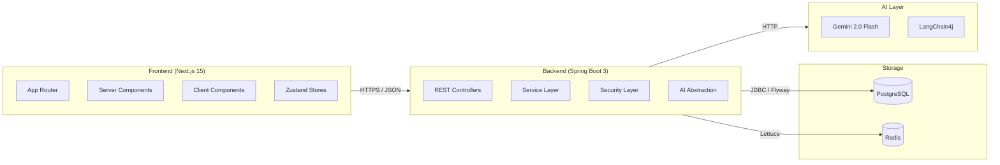

<p align="center">
  
  
  
  
  
  
  
  
  
</p>

<p align="center">
  <samp>
    <strong>AI Job Copilot</strong><br/>
    <em>Apply smarter. Interview better. Get hired faster.</em>
  </samp>
</p>

---

**AI Job Copilot** is a production-grade SaaS platform that combines resume intelligence, ATS scoring, AI-powered tailoring, interview coaching, and application tracking into one guided system for job seekers.

**The problem:** Job applications are fragmented — you update a resume in one tool, paste a JD in another, track applications in a spreadsheet, and prep for interviews somewhere else. Nothing connects.

**What this solves:** One system where every piece shares the same career context. Upload a resume once. Paste a JD. The system scores your match, tailors your resume, generates a cover letter, coaches you for the interview, and tracks the application — all on the same data.

---

## Screenshots

Product screenshots will be added after the app is run locally or deployed with sanitized demo data. These captures are planned to show the main recruiter-facing product flows without exposing environment details or private user information.

> Screenshots should not contain secrets, API keys, database URLs, or real user data.
> Full capture checklist: [`docs/PROJECT/07_PORTFOLIO_RELEASE_CHECKLIST.md`](docs/PROJECT/07_PORTFOLIO_RELEASE_CHECKLIST.md)

| View | Caption | Planned Image Path |
|---|---|---|
| Landing Page | Public product positioning, value proposition, and primary calls to action. | `docs/screenshots/landing-page.png` |
| Dashboard | Authenticated overview of resume, job, interview, and application activity. | `docs/screenshots/dashboard.png` |
| Resume Upload | Resume ingestion flow with PDF/DOCX upload and validation feedback. | `docs/screenshots/resume-upload.png` |
| ATS Score | Match score breakdown with keyword, experience, education, and formatting insights. | `docs/screenshots/ats-score.png` |
| Application Tracker | Kanban/list workflow for managing applications, statuses, notes, and next actions. | `docs/screenshots/application-tracker.png` |
| Analytics | Pipeline metrics, trends, recent activity, and performance summaries. | `docs/screenshots/analytics.png` |
| Settings | Profile, account, preferences, and security-related settings. | `docs/screenshots/settings.png` |

---

## Features

### Resume Intelligence 📄
Upload PDF/DOCX resumes. Automatic parsing extracts skills, experience, and education. Tika-based content verification prevents malicious uploads. Versioned storage keeps history.

### ATS Score Engine 📊
Score any resume against a target job. Category breakdowns for keywords, experience fit, education alignment, and formatting quality. Direct fix suggestions with priority ranking.

### Job Description Analysis 🔍
Paste a job description and get structured analysis: required skills, experience level, role fit score, keyword gaps, and certification matches.

### AI Resume Tailoring ✨
Rewrite resume bullets to match a specific job description using Gemini 2.0 Flash. Tuned for ATS optimization while preserving factual accuracy. Validator catches hallucinated credentials.

### Cover Letter Generator 📝
Generate tailored cover letters from your resume + job description. Multiple tones and templates. Structure validation ensures quality. Editable before export.

### Interview Coach 🎤
Practice with AI-generated questions based on the job you are chasing. Get structure feedback, follow-up prompts, and scoring. Track progress across sessions.

### Application Tracker 📋
Kanban board + list view. Track status, notes, salary, next actions, and linked AI artifacts per application. Filter, sort, search, archive.

### Analytics Dashboard 📈
Pipeline overview, ATS score trends, interview performance, top matched skills, and recent activity timeline. All metrics computed from real usage data.

---

## Architecture



**Backend layers** (`com.aicopilot/`):

| Layer | Components |
|---|---|
| **Controllers** | Auth, Resume, JobDescription, Match, Tailor, CoverLetter, Interview, Application, Job, Analytics, User — 11 REST controllers |
| **Services** | AuthService, ResumeService, JobDescriptionService, MatchService, TailoringService, CoverLetterService, InterviewService, ApplicationService, JobService, AnalyticsService, UserService, EmailService, FileStorageService — 15 service classes |
| **Security** | JwtTokenProvider, JwtAuthenticationFilter, CustomUserDetailsService, RateLimitingFilter, TokenHashUtils |
| **AI** | AiService interface with Gemini + Mock implementations. Separate services for tailoring, JD analysis, cover letters, and interview coaching |
| **Data** | 10 JPA entities with UUID PKs, 10 repositories, Flyway migrations (V1–V9) |

**Frontend layers** (`src/`):

| Layer | Content |
|---|---|
| **Routes** | 12 route groups — auth (login, register, forgot/reset password), dashboard, resumes, jobs, tracker, cover-letters, interviews, analytics, settings |
| **Components** | 30+ feature components, 10 UI primitives, landing page (hero, features, pricing, FAQ, how-it-works), DashboardShell, Sidebar, Topbar |
| **State** | 12 Zustand stores for client state, React Query for server state |
| **Design** | Glassmorphism light/dark theme, Framer Motion animations, Tailwind CSS custom design tokens, responsive from 375px to 1440px |

---

## Tech Stack

### Backend

| Technology | Role |
|---|---|
| **Java 21** | LTS runtime — records, sealed classes, pattern matching |
| **Spring Boot 3.3.1** | Web, Security, Data JPA, Validation, Actuator, Mail |
| **PostgreSQL 16** | Primary database with Flyway (V1–V9) |
| **Redis 7** | Rate limiting, token blacklisting, caching |
| **LangChain4j 1.0.0-beta1** | AI orchestration (Gemini 2.0 Flash + 1.5 Pro) |
| **JJWT 0.12.6** | Stateless auth (HS256 access + refresh tokens) |
| **Testcontainers** | Integration tests with disposable PostgreSQL |
| **JUnit 5 + Mockito** | 286 tests across all service layers |
| **Apache Tika 2.9.1** | File content-type verification |
| **Lombok** | Boilerplate reduction |
| **Maven 3.9** | Build and dependency management |

### Frontend

| Technology | Role |
|---|---|
| **Next.js 15 (App Router)** | Server components, middleware, static generation, API clients |
| **React 19** | UI rendering, hooks, server components |
| **TypeScript 5** | Full type safety across 80+ components |
| **Tailwind CSS 3** | Utility-first styling, custom design tokens, dark mode |
| **Framer Motion 11** | Page transitions, scroll animations, micro-interactions |
| **TanStack React Query 5** | Server state, caching, optimistic updates |
| **Zustand 5** | Lightweight client state management |
| **Recharts** | Analytics charts (pipeline, trends, performance) |
| **Lucide React** | Consistent icon system |
| **ShadCN UI / Radix** | Accessible UI primitives (Slot) |
| **next-themes** | Dark/light mode with CSS variables |

### Infrastructure & AI

| Technology | Role |
|---|---|
| **Docker Compose** | Local PostgreSQL + Redis |
| **Google Gemini API** | AI inference (Flash for speed, Pro for complexity) |
| **AWS (target)** | Production: ECS, RDS, ElastiCache, S3, CloudFront |

---

## Security

| Feature | Implementation |
|---|---|
| **Authentication** | Stateless JWT — access token (15 min) + refresh token (7 days) |
| **Token Rotation** | Refresh tokens are rotated on every use; old tokens invalidated |
| **Token Storage** | Refresh tokens hashed with SHA-256 before database storage |
| **Password Hashing** | BCrypt with strength 12 |
| **Account Lockout** | 5 failed attempts → 15-minute lockout |
| **Rate Limiting** | Auth endpoints: 10 req/min. AI: 5 req/month (free) / 10,000 req/month (pro) |
| **No Email Enumeration** | Forgot-password returns identical response whether email exists or not |
| **CORS** | Configurable whitelist via `CORS_ALLOWED_ORIGINS` — no wildcard |
| **File Upload** | 5 MB limit, PDF/DOCX only, Tika content-type verification, path traversal protection |
| **Input Validation** | Server-side `@Valid` annotations + global exception handler |
| **HTTPS** | Enforced in production |
| **Secure Cookies** | HttpOnly, Secure, SameSite in production |
| **Secret Audit** | Full public-release secret sweep completed — no secrets in tracked files |

---

## Testing

| Suite | Command | Result |
|---|---|---|
| Backend unit + integration | `mvn clean test` | **286 tests, 0 failures** |
| Frontend type checking | `npm run type-check` | **0 errors** |
| Frontend production build | `npm run build` | **0 errors, 16 routes** |

Backend tests cover: AuthService, ResumeService, JobDescriptionService, MatchService, TailorValidatorService, ScoreExplanationService, RecommendationService, UserService, InterviewService, CoverLetterValidator, ApplicationService, JobService, AnalyticsService, file storage, and rate limiting. Integration tests use Testcontainers (disposable PostgreSQL containers, no external services required).

---

## Quick Start

```bash
# 1. Clone
git clone https://github.com/shivrajks/ai-job-copilot.git
cd ai-job-copilot

# 2. Start infrastructure (PostgreSQL + Redis)
cd docker
docker compose up -d

# 3. Start backend
cd ../backend
$env:JWT_SECRET="dev-jwt-secret-key-ai-copilot-2024-at-least-256-bits-long!!"
mvn clean test        # verify 286 tests pass
mvn spring-boot:run   # API at http://localhost:8080/api

# 4. Start frontend (new terminal)
cd ../frontend
npm install
npm run dev            # app at http://localhost:3000
```

> Full local setup guide: [`docs/DEPLOYMENT/02_LOCAL_SETUP_GUIDE.md`](docs/DEPLOYMENT/02_LOCAL_SETUP_GUIDE.md)  
> Production deployment guide: [`docs/DEPLOYMENT/03_PRODUCTION_SETUP_GUIDE.md`](docs/DEPLOYMENT/03_PRODUCTION_SETUP_GUIDE.md)

---

## Project Journey

```
Sprint 1B–5D  ████████████████░░░░░░  Foundation, Auth, UI, Resumes
Sprint 6E–7F  ████████████████░░░░░░  JD Analysis, ATS Scoring
Sprint 8G     ██████████████████░░░░  Gemini AI Integration
Sprint 9H–10I ██████████████████░░░░  Interview Coach, Tracker
Sprint 11J    ████████████████████░░  Analytics Dashboard
Sprint 12–13  ████████████████████░░  Infrastructure Hardening
Sprint 14–18  ████████████████████░░  Backend Expansion
Sprint 19–20  ████████████████████░░  Security Fixes
Sprint 21–25  ████████████████████░░  Premium Frontend Redesign
Sprint 26–27  ████████████████████░░  Release Readiness + Audit
```

**Phases:**
- **Foundation** — Spring Boot 3 + Next.js 15 monorepo, Docker Compose, auth, UI system, resume management
- **Core modules** — Job analysis, ATS scoring engine, Gemini AI integration, interview coach, application tracker, analytics dashboard
- **Hardening** — Production security (rate limiting, account lockout, path traversal), response standardization, test expansion
- **Premium frontend** — Glassmorphism design system, dark/light mode, landing page (hero, features, pricing, FAQ, workflow), animations
- **Release** — Deployment guides, documentation, secret audit, portfolio preparation

---

## Portfolio Notes

**What I built:** A full-stack SaaS platform from scratch — 2,000+ hours of engineering across 27 sprints covering the complete product lifecycle from requirements to release readiness.

**Why it matters:** Job searching is stressful and fragmented. This system connects every piece — resume, job description, interview prep, application tracking — into one intelligence layer that actually helps you get hired.

**Engineering decisions:**
- Monorepo with separate frontend/backend/docker/docs — clear boundaries, independent deployability
- Spring Boot 3 layered architecture with AI abstraction — swap Gemini for any LLM without touching business logic
- Design system before features — glassmorphism, dark mode, and accessible components built first, then applied across all modules
- Test-first service layer — 286 tests with mock AI provider so tests never depend on external API availability

**What I learned:** Stateless JWT rotation is trickier than it sounds. Flyway migrations need to match JPA entities exactly or your build breaks at runtime. A good design system saves an enormous amount of frontend rework. Testcontainers is a game changer for database-layer tests.

---

## Links

- **GitHub Profile:** [shivrajks](https://github.com/shivrajks)
- **Repository:** [github.com/shivrajks/ai-job-copilot](https://github.com/shivrajks/ai-job-copilot)
- **Project Documentation:** [`docs/`](docs/) — ADRs, changelog, roadmap, personas, engineering standards, deployment guides, release checklist

---

<p align="center">
  <samp>
    <em>Built with discipline, security, and production-quality engineering.</em>
  </samp>
</p>

<p align="center">
  <sub>MIT License — see <a href="LICENSE">LICENSE</a> for details.</sub>
</p>
